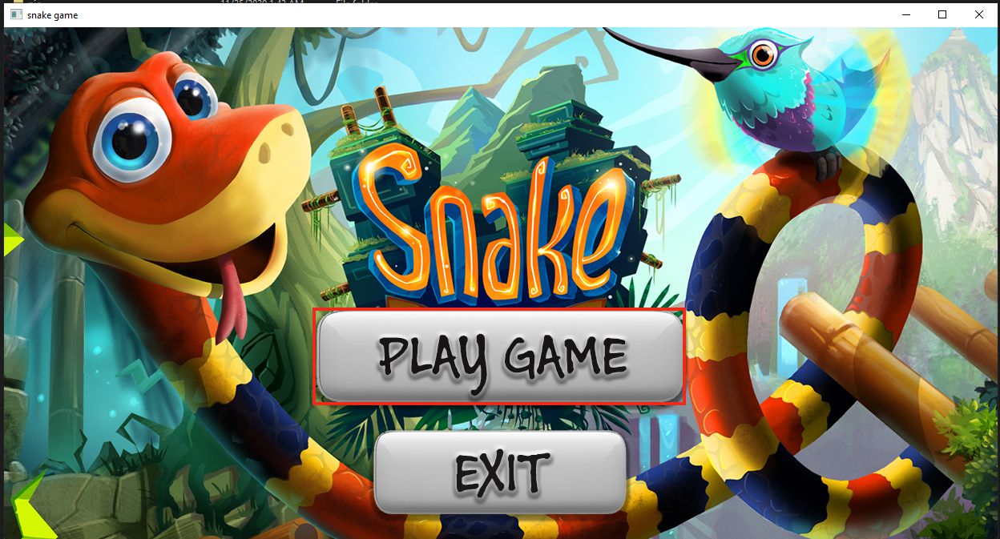
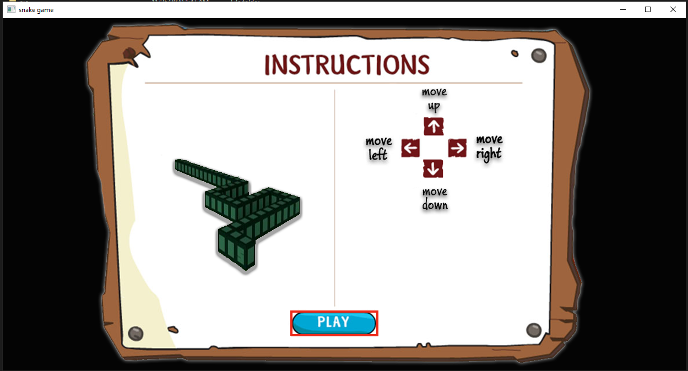
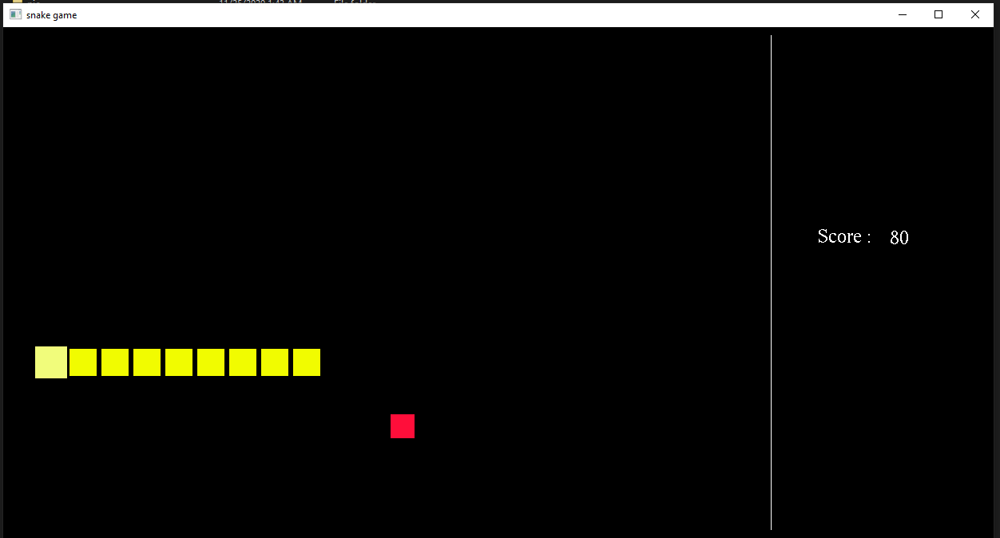
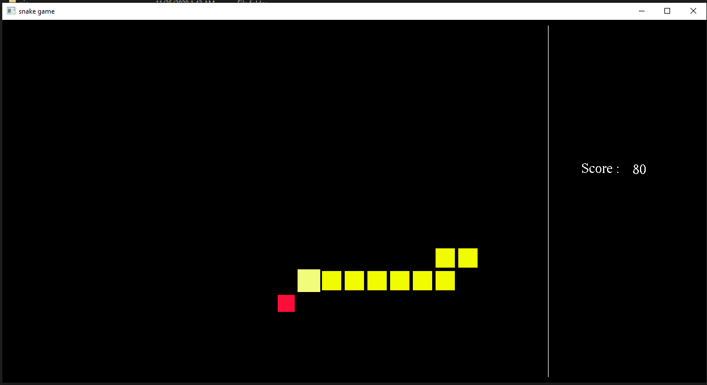
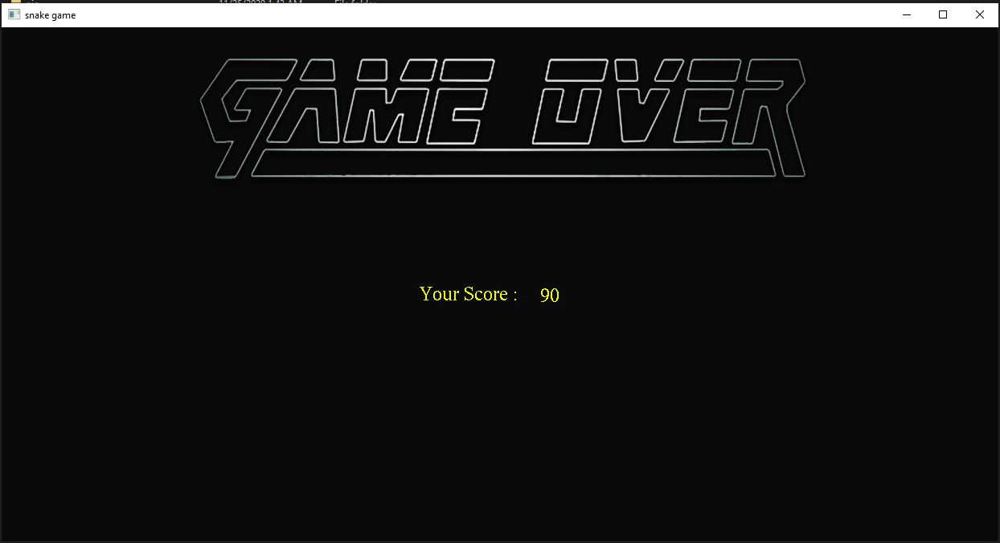

# Snake2_iGraphics
 This project was made in 2017. After learning iGraphics. Then i try to build something in graphical pattern that i use to make before.

## Project description
Name: Snake2  
Programming Language: C++  
GUI: iGraphics
Project No: 3  
Year: 2017

## Demo Video

## Screen shot
### Homescreen
 

### Instruction Page
 

### Game Window
 

 

### GameOver
 

## Authors

* **AbirHasan**

Check out my other works [@XAbirHasan](https://github.com/XAbirHasan)